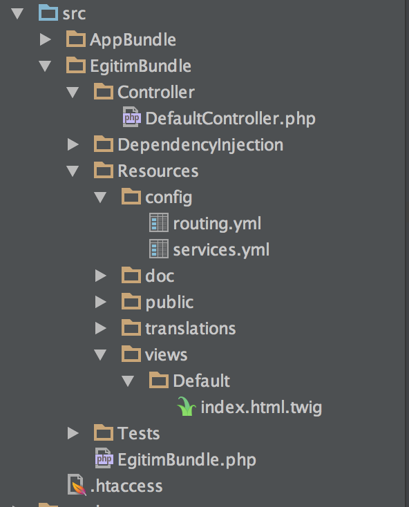

##Bundle

Bundle kavramını birinci bölümde işlemiştik.Kısaca tekrar açıklamak gerekirse kod bohçası yani kodlarımızın bulunduğu dosya arşividir.

Yeni bundle oluşturmak için :

```php app/console generate:bundle ```

Akış aşağıdaki gibi olacaktır.


> ADIM 1
> - Bundle namespace: EgitimBundle

> -  Keep EgitimBundle as the bundle namespace (choose no to try again)? [yes]: [ENTER]

> - Bundle name [EgitimBundle]: [ENTER]

> - Target directory [/Applications/MAMP/htdocs/yeni_symfony_projem/src]: [ENTER]

> - Configuration format (yml, xml, php, or annotation): yml

> - Do you want to generate the whole directory structure [no]? yes

> - Do you confirm generation [yes]? 

> - Confirm automatic update of your Kernel [yes]? 

> - Confirm automatic update of the Routing [yes]? 

Son üç adımda enter tuşuna basıp bundle kurulumunu tamamlıyoruz.Ardından dosya dizinlerine erişim için tekrardan ```chmod -R 777 /Applications/MAMP/htdocs```
yazıyoruz.

Bundle şuanda src dizininin altında yer almakta!
