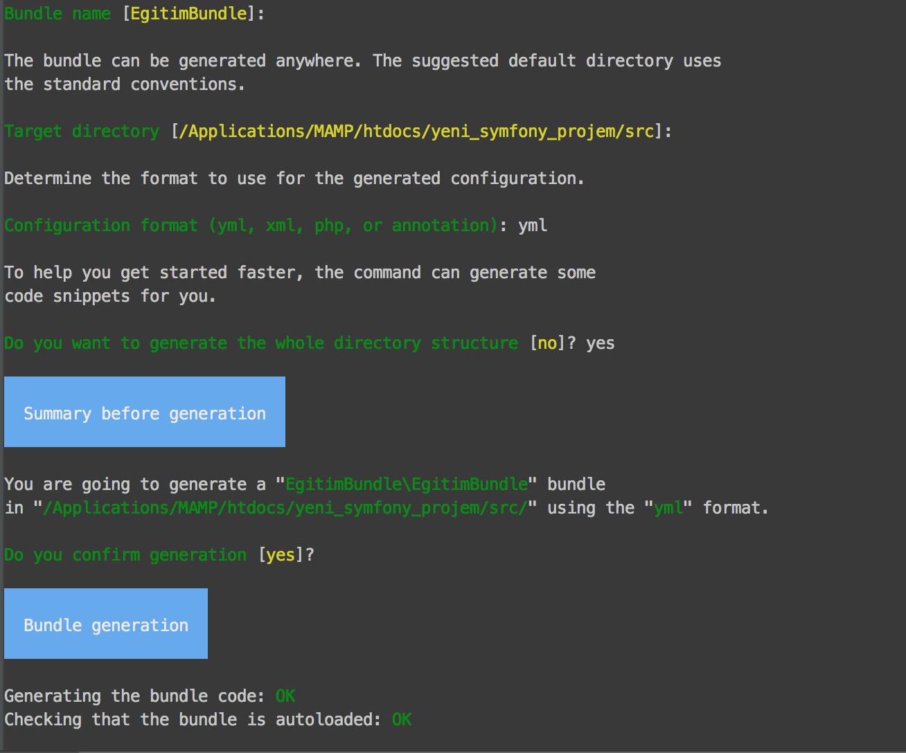

##Bundle

Bundle kavramını birinci bölümde işlemiştik.Kısaca tekrar açıklamak gerekirse kod bohçası yani kodlarımızın bulunduğu dosya arşividir.

Yeni bundle oluşturmak için :

```php app/console generate:bundle ```

](1.png)
