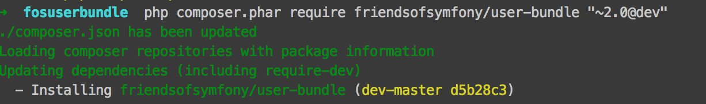
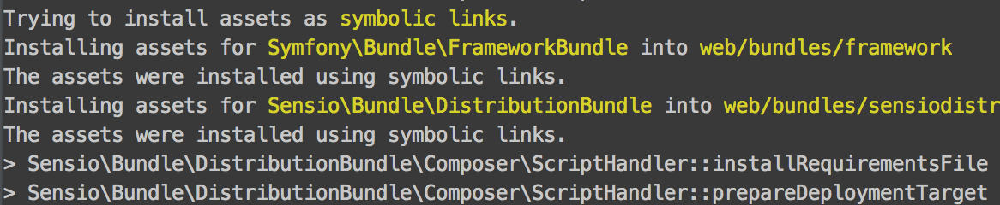

##Ek paketler

Frameworks'ler yani uygulama çatıları güçlerini ek paketlerden alır. Ek paketler symfony içerisinde **bundle** adı ile ifade edilir. 

Symfony'de ek paketler, composer adını verdiğimiz bağımlılık yöneticisi ile projemize dahil olurlar. Sonraki sayfalarda aktif olarak composer ile ek paketleri çekip projemize dahil edeceğiz.

Şimdi, symfony'nin en çok kullanılan **fos user bundle** adlı ek paketini projemize nasıl dahil edeceğimizi görelim.

----------

Projemizde composer bağımlılık yardımcısını kullanarak fosuser paketini projemize çekelim.



```php composer.phar require friendsofsymfony/user-bundle "~2.0@dev"```

İlgili süreç tamamlandığında aşağıdaki çıktıya benzer bir çıktı alacağız.



Ek paketi başarıyla projemize ekledik fakat kurulumunu sonraki sayfalarda yapacağız.