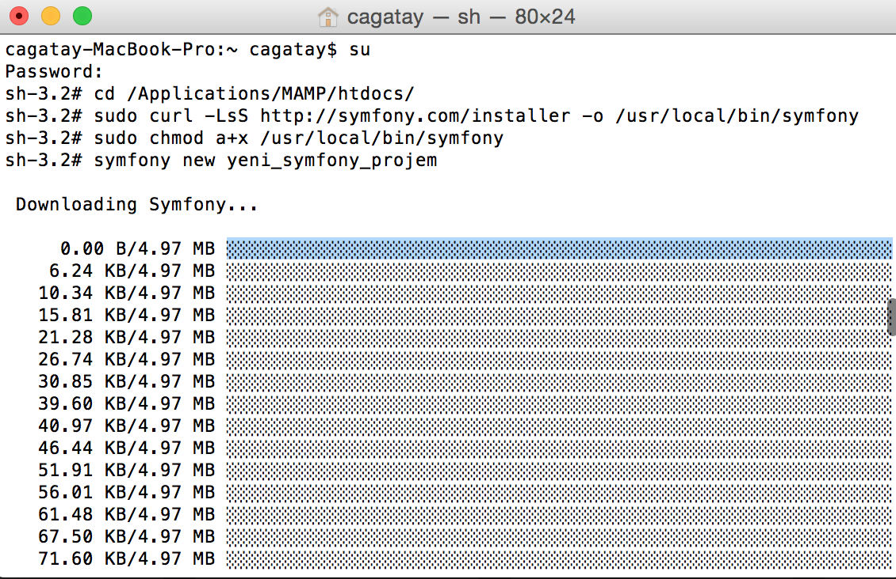

#Kurulum
Symfony kendi kurulum yardımcısıyla hızlı bir şekilde kurulabilir.


İlk olarak kuracağımız dizine terminal üzerinden cd komutuyla gelip şu satırları işleyelim.
#### Linux ve Mac OS X için; 
```
$ sudo curl -LsS http://symfony.com/installer -o /usr/local/bin/symfony
$ sudo chmod a+x /usr/local/bin/symfony
```

#### Windows için;
```
c:\> php -r "readfile('http://symfony.com/installer');" > symfony
```

Ardından ;
```
symfony new yeni_symfony_projem
```
Satırını terminale işlediğinizde projeniz o isimle bulunduğunuz dizinde kurulacaktır.Bulunduğunuz dizine yazma izinlerini vermeyi unutmayın.Aksi taktirde yazma ve silme işlemleri yapılamayacaktır.




Linux'da dizine erişim izni için;
```
chmod -R 777 /var/www/html
```
Mac OS X 'de dizine erişim izni için;

```chmod -R 777 /Applications/MAMP/htdocs ```


